# ShopTriage

AI-powered call triage and routing for independent auto repair shops, built for the
**AWS Zero to Shipped Hackathon 2026**.

**Live app:** https://d22i5q9f7x15b9.cloudfront.net

## The problem

A local independent auto repair shop handles roughly 200 cars a month and relied on one person
to answer and triage every incoming call. When that person left, the owner and his wife were
buried in voicemails with no system to sort them — urgent calls, routine status checks, vendor
calls, and spam all landed in the same inbox with no way to tell them apart. Customers (including
the person building this project, whose own repair had failed) waited weeks for a callback that
should have taken a day.

ShopTriage makes sure every voicemail is transcribed, classified, routed to the right person, and
escalated automatically if nobody acknowledges it in time.

## Architecture

A voicemail lands in S3 and triggers `start_transcription`, which starts an Amazon Transcribe job
and exits immediately (it never polls). When Transcribe finishes, an EventBridge rule hands the
transcript to `process_transcript`, which sends it to Claude for **classification only** —
category, urgency, whether it's a comeback, and caller details. Claude never decides who gets
notified; that decision lives entirely in EventBridge rules on a custom bus, so the shop can
change staffing policy without touching the AI prompt.

Those rules fan out to SNS (urgent per-role alerts) and SQS with dead-letter queues (front-office
and vendor calls). Urgent and comeback alerts also start a Step Functions Standard workflow that
emails a staff member an acknowledgment link (`waitForTaskToken`), re-alerts and escalates to the
owner on timeout, and marks the call overdue if a second timeout passes unacknowledged. Every
stage writes a timeline event to a single DynamoDB table (with a GSI for the callback board — no
table scans anywhere), exposed to a React frontend via an API Gateway HTTP API.

### AWS services used, and why

| Service | Why |
|---|---|
| S3 + CloudFront | Static frontend hosting and voicemail/transcript storage; CloudFront gives HTTPS + a public URL with no server to manage. |
| Amazon Transcribe | Turns voicemail audio into text without running any ASR infrastructure ourselves. |
| Claude (Anthropic API) | Classifies each transcript into structured JSON — category, urgency, caller details — used as-is by the routing rules. |
| Lambda (8 functions, per-function IAM roles) | All application logic; least-privilege roles instead of one shared catch-all role. |
| EventBridge (default bus + custom `shop-triage-bus`) | Decouples classification from routing. The custom bus's rules encode staffing policy declaratively, with a 7-day archive for replay. |
| SNS | Fan-out for per-role email-worthy alerts (oncall, owner). |
| SQS + DLQ | Durable queues for calls that don't need immediate escalation (front office, vendor), with dead-letter queues + CloudWatch alarms so a stuck consumer is visible within a minute. |
| Step Functions (Standard) | `waitForTaskToken` human-in-the-loop escalation with a durable, inspectable execution history — a Lambda polling loop can't do this safely. |
| DynamoDB (single table + GSI1) | Call records, timeline events, and staff inbox rows in one table; the GSI supports the callback board with `Query`, never `Scan`. TTL auto-expires demo data after 7 days. |
| SES | Staff email alerts (SMS was ruled out — US 10DLC/toll-free registration wouldn't clear in time for the hackathon deadline). |
| API Gateway (HTTP API) | Cheaper and simpler than REST API for this use case; CORS locked to the CloudFront origin, throttled (rate 2, burst 5). |
| SSM Parameter Store (SecureString) | Anthropic API key, fetched once on cold start and cached — cheaper than Secrets Manager for a single key. |
| AWS Budgets | $20/month cost guardrail with email alerts at 80% actual and 100% forecasted spend. |

## v1 vs. v2 architecture comparison

v1 was an earlier, headless property-management call-triage project the same builder shipped:
intake and Claude classification only, one per-call email to a single recipient plus a weekly digest, no routing, no
acknowledgment, no dead-letter queues, and DynamoDB reads via full table scans. Everything
highlighted in blue below is new in ShopTriage (v2).

```mermaid
graph TD
    subgraph v1["v1: Property Management Call Triage (headless)"]
        v1Goto["GoTo Connect\ncall recordings"] --> v1S3["S3: recordings/\n(existing bucket)"]
        v1S3 --> v1ST["start_transcription"]
        v1ST --> v1TR["Amazon Transcribe"]
        v1TR --> v1EB["EventBridge\n(Transcribe job state change)"]
        v1EB --> v1PT["process_transcript"]
        v1PT --> v1Claude["Claude: classify"]
        v1Claude --> v1DDB[("DynamoDB CallLog\n(Scan-based reads)")]
        v1PT --> v1SES["SES: per-call email\nto the property manager"]
        v1Sched["EventBridge weekly schedule\n(Monday 08:00)"] --> v1Weekly["weekly_summary\n(Claude writes the highlights)"]
        v1DDB -.->|scanned for the past 7 days| v1Weekly
        v1Weekly --> v1WSES["SES: weekly digest email"]
    end

    subgraph v2["v2: ShopTriage (this project)"]
        v2S3["S3: voicemail upload"] --> v2ST["start_transcription"]
        v2ST --> v2TR["Amazon Transcribe"]
        v2TR --> v2EB["EventBridge default bus"]
        v2EB --> v2PT["process_transcript"]
        v2PT --> v2Claude["Claude: classify only
(never decides routing)"]
        v2Claude --> v2DDB[("DynamoDB single table
+ GSI1, no Scans")]
        v2DDB --> v2Bus{{"shop-triage-bus
custom EventBridge bus + archive"}}
        v2Bus --> v2Rules["Routing rules
by category / urgency"]
        v2Rules --> v2Disp["routing_dispatcher
marks routed, starts escalation"]
        v2Rules --> v2SNS["SNS: oncall / owner
alert topics"]
        v2Rules --> v2SQS["SQS + DLQ
(front office / vendor queues)"]
        v2Rules --> v2Spam["CloudWatch Logs:
spam calls, log only"]
        v2Disp --> v2SFN["Step Functions
escalation + acknowledgment"]
        v2SFN --> v2Send["send_alert"]
        v2Send --> v2SES["SES: alert email
with Acknowledge link"]
        v2SQS --> v2Alarm["CloudWatch alarm:
DLQ depth"]
        v2React["React web app
(demo console / callback board / staff inbox)"] --> v2API["API Gateway HTTP API
(incl. GET /ack)"]
        v2API --> v2Handler["api_handler"]
        v2Handler --> v2DDBRead[("DynamoDB
Query on GSI1")]
    end

    class v2Bus,v2Rules,v2Disp,v2SNS,v2SQS,v2Spam,v2SFN,v2Send,v2SES,v2Alarm,v2DDB,v2DDBRead,v2API,v2Handler,v2React new
    classDef new fill:#1f2d3d,stroke:#58a6ff,stroke-width:2px,color:#58a6ff;
```



*(Source: [`docs/architecture-comparison.mmd`](docs/architecture-comparison.mmd). GitHub renders
the fence above directly. The About page shows the same diagram rebuilt as plain HTML/CSS
(`frontend/src/components/ArchitectureDiagram.jsx`) rather than an embedded image or a
client-rendered Mermaid SVG — see the Trade-offs section below for why.)*

## Testing

All six sample voicemails were run through the real pipeline end-to-end (`POST /demo/calls` →
Transcribe → Claude classification → EventBridge routing → the correct Staff Inbox / Callback
Board queue), including driving both possible escalation outcomes — a clean acknowledgment inside
the ack window, and a full timeout-to-overdue run — for both urgency levels that escalate
(`emergency` and `comeback`).

That testing pass caught two real, previously-undetected bugs, both now fixed and re-verified live:

- **Spam calls were silently dropped since Day 3.** The EventBridge rule that logs `spam_other`
  calls to CloudWatch had a resource policy granting the wrong principal
  (`delivery.logs.amazonaws.com` instead of `events.amazonaws.com`) and an invalid action name —
  every single invocation had failed since the rule was created, confirmed via
  `AWS/Events` CloudWatch metrics (100% `FailedInvocations`).
- **A tampered acknowledgment link could silently kill a different call's real escalation.** The
  ack endpoint trusted a `token` and `call_id` from the query string independently, with nothing
  tying them together. Confirmed live: a token belonging to call B, combined with call A's
  `call_id`, resumed B's real escalation workflow (permanently, with no re-alert and no overdue
  status ever recorded) while showing a success page claiming the unrelated call A was
  acknowledged. Fixed by having each alert write its outstanding task token onto the call's own
  DynamoDB record, and having the ack endpoint verify the two match before doing anything else.

## How to deploy

Requires the AWS SAM CLI, Python 3.12, Node.js, and an AWS profile with permission to create the
resources in `template.yaml`.

```bash
# One-time: local settings (both files are gitignored, copy the examples)
cp samconfig.toml.example samconfig.toml        # set your AWS profile and AlertEmail
cp frontend/.env.example frontend/.env.production  # set the API endpoint after the first deploy

# Backend
sam build --parallel
sam deploy

# One-time: overwrite the Anthropic API key placeholder
aws ssm put-parameter --name "/shoptriage/anthropic-api-key" \
  --value "<your key>" --type SecureString --overwrite --profile shoptriage-agent

# One-time: generate the sample voicemails
python scripts/make_samples.py --profile shoptriage-agent

# Frontend
cd frontend
npm install
npm run build
aws s3 sync dist s3://<FrontendBucketName output> --delete --profile shoptriage-agent
aws cloudfront create-invalidation --distribution-id <CloudFrontDistributionId output> --paths "/*" --profile shoptriage-agent
```

`AlertEmail` is the SES address that sends alerts (and, in this demo, receives all of them); SES
emails you a verification link the first time. Stack outputs
(`aws cloudformation describe-stacks --stack-name shoptriage`) give the bucket name,
distribution ID, and API endpoint needed above.

## Trade-offs

- **The architecture diagram exists in two hand-maintained forms.** `docs/architecture-comparison.mmd`
  is the Mermaid source GitHub renders in this README. The About page shows the same diagram
  rebuilt as plain HTML/CSS (`ArchitectureDiagram.jsx`), not a client-rendered Mermaid SVG. That
  switch happened after Mermaid's `<foreignObject>`-based HTML labels turned out to inherit the
  page's own CSS reset, shrinking each label's usable width after Mermaid had already measured it
  and clipping text — a page-vs-library CSS conflict that a plain-markup rebuild sidesteps
  entirely, at the cost of two representations to update by hand if the diagram's content ever
  changes.
- **Single-region, single-account.** No multi-region failover; acceptable for a hackathon demo,
  not for production.
- **Demo-mode ack windows.** Escalation timeouts are seconds (60s/90s) via an env var, not the
  real 15-minute/2-hour windows in the Build Plan — swapping them back is a config change, no
  code change.
- **Routing logic exists in two places.** EventBridge rules do the actual SNS/SQS fan-out;
  `routing_dispatcher._determine_channel()` mirrors that same logic to record what happened in
  DynamoDB. They have to be kept in sync by hand — there's no automated check that they agree.
- **No SMS.** Ruled out because US 10DLC/toll-free registration wouldn't clear in time for the
  hackathon deadline. Email via SES instead.
- **Account-wide budget, not tag-scoped.** The $20/month AWS Budget covers the whole AWS account
  rather than filtering by the `project=shoptriage` tag, since tag-based cost filtering requires
  activating cost allocation tags in the Billing console first (a manual one-time step). This
  account is dedicated to this hackathon project, so account-wide is equivalent in practice.
- **DynamoDB TTL is set per-item, not per-call.** Each timeline event's TTL is computed 7 days
  from the moment *that event* is written, not from when the call itself was created. For a call
  that escalates, the final `overdue` event's TTL can land up to ~30 minutes (emergency) to ~4
  hours (comeback) after the call's own `META` record's TTL, using the real (non-demo) ack
  windows. That means roughly 7 days after a call finishes, there's a window where the call's
  record has expired but a couple of its late-stage timeline events technically haven't yet — in
  practice invisible (`GET /calls/{id}/timeline` just 404s, same as any unknown call), but worth
  knowing about. A real fix means computing one expiry per call at creation and threading it
  through every Lambda that writes a timeline event for that call; not done here.

## Future work

- Real SMS once 10DLC/toll-free registration is approved.
- Direct integration with a real phone system (e.g. a SIP trunk or a call-center product) instead
  of manually dropped voicemail files.
- Multi-shop SaaS: per-shop tenancy, staff accounts and auth, and a self-serve onboarding flow
  instead of one shop's hardcoded sample data and role list.
